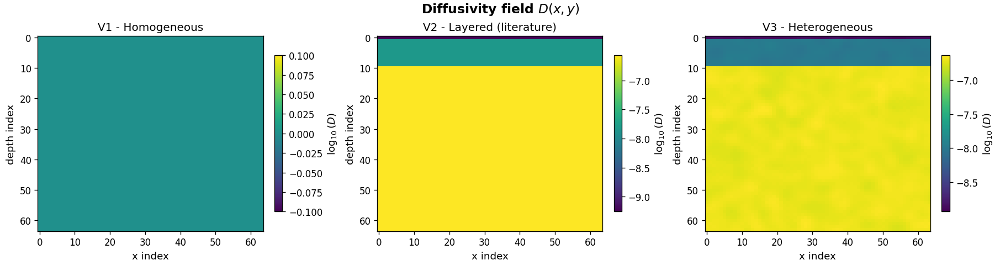
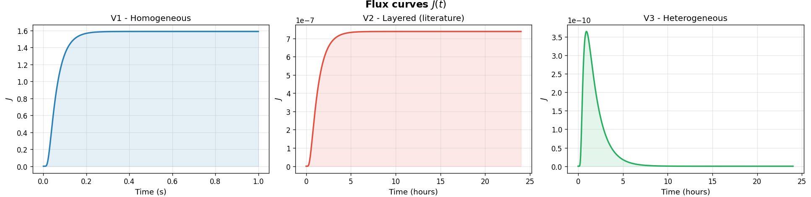
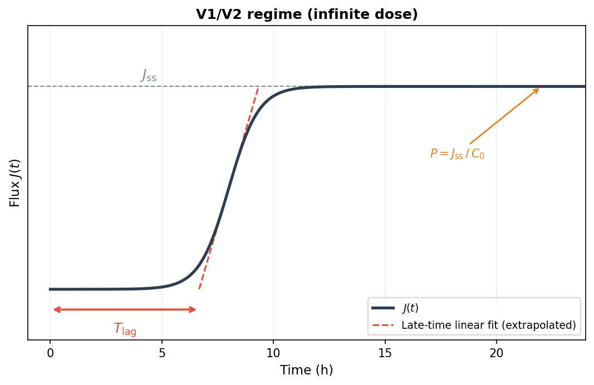
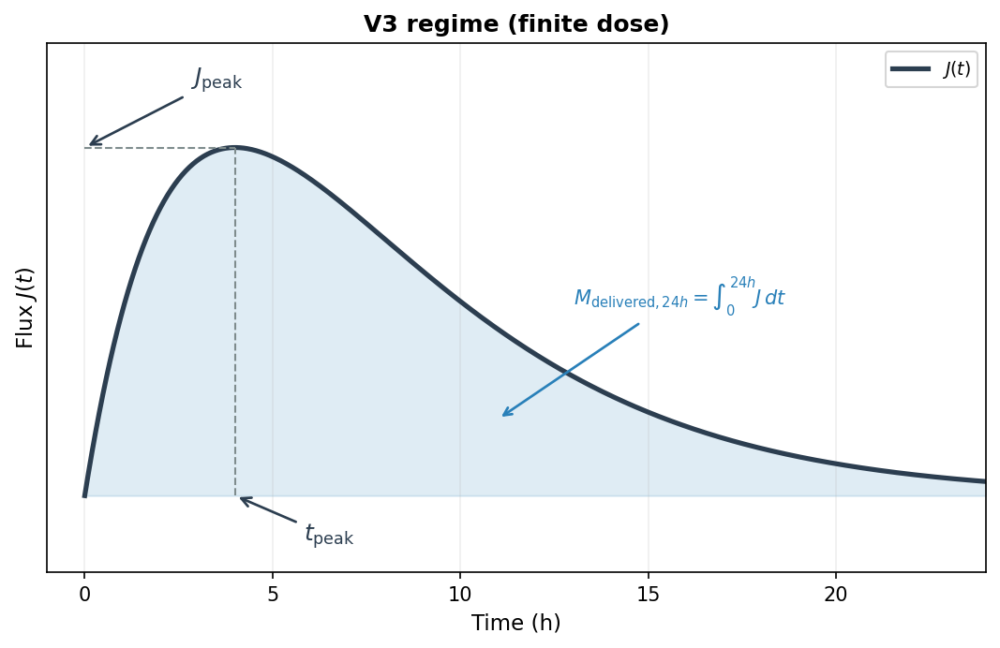
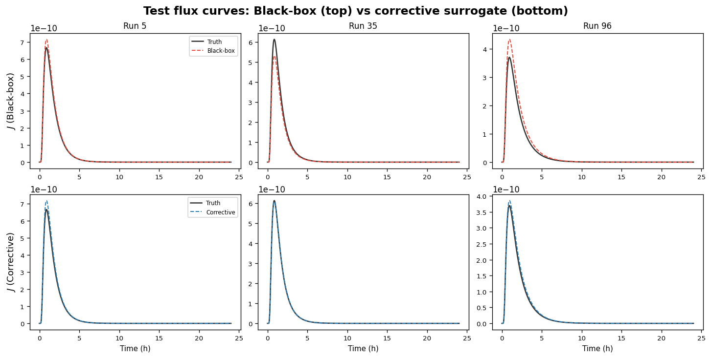
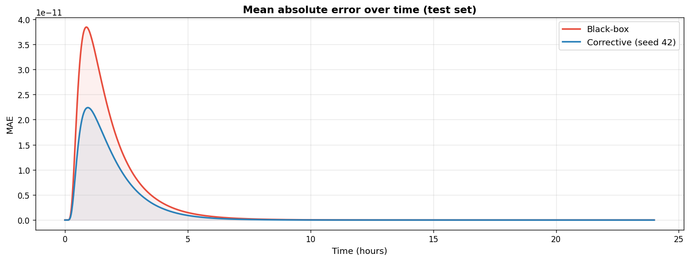
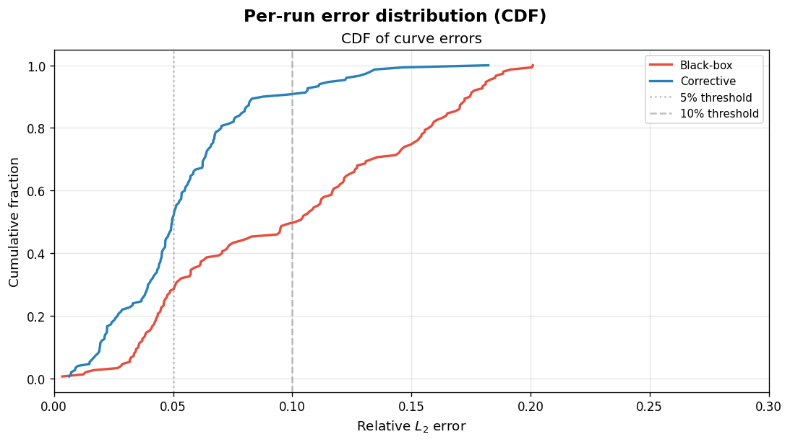
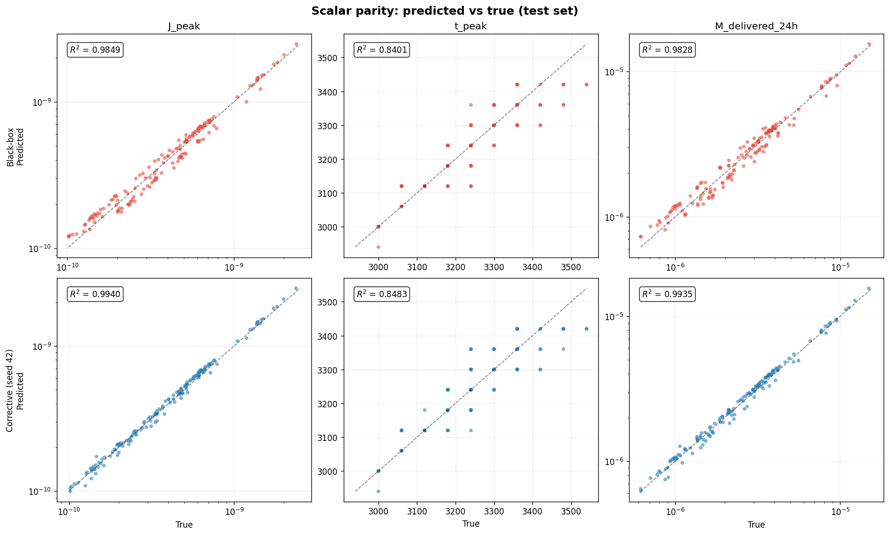

# Transdermal Drug Diffusion Simulator + ML Surrogates

A 2D finite-difference simulator for transdermal drug diffusion, with a
config-driven dataset pipeline and ML surrogate comparison workflow.

This repository supports the final report:
**"Transdermal Drug Diffusion: An End-to-End Finite-Difference Simulation and
Physics-Corrected Surrogate Framework"**.

The project builds a mechanistic skin-diffusion simulator, validates it through
progressively harder regimes, generates a structured synthetic dataset, and then
tests whether a physics-corrected surrogate can improve on a strong black-box
baseline while retaining major runtime advantages.

## Report Overview

The project is organised around one central question: can a fast ML surrogate
approximate a validated transdermal diffusion simulator while gaining accuracy
from physics-aware correction?

The end-to-end framework has four main stages:

1. **Finite-difference simulator**: a 2D transport solver with donor patch,
   bottom sink, layered diffusivity, dermal clearance, heterogeneous diffusion,
   and finite-dose donor decay.
2. **Progressive validation**: V1 verifies the numerical method, V2 anchors the
   layered model against lidocaine literature targets, and V3 becomes the final
   heterogeneous finite-dose regime for dataset generation.
3. **Dataset pipeline**: 1,000 V3 simulations are assembled into train/val/test
   splits spanning patch geometry, donor conditions, dermal clearance, and
   spatial heterogeneity.
4. **Surrogate comparison**: a PCA/Ridge black-box surrogate is compared against
   a bounded physics-corrected hybrid using curve metrics, scalar transport
   metrics, diagnostics, timing, and multi-seed robustness.

Key report findings:

- V1 shows numerical convergence and matches a 1D analytic slab benchmark.
- V2 reproduces the lidocaine permeability and lag-time calibration targets to
  within 0.1%.
- V3 generates finite-dose rise-peak-fall flux curves suitable for surrogate
  learning.
- The black-box model reaches test relative L2 `0.0789` and Pearson `0.9967`.
- The physics-corrected surrogate reduces test relative L2 to about `0.0505`
  across three report seeds.
- Surrogate inference remains orders of magnitude faster than the simulator:
  about `2.8e6x` for the black-box on CPU, `1.22e4x` for the hybrid on CPU, and
  `4.14e5x` for the hybrid on GPU.

## Project At A Glance

| Area | What is included |
|---|---|
| Simulator | 2D explicit finite-difference diffusion with donor patch, bottom sink, layered diffusivity, optional dermal clearance, heterogeneity, and finite-dose donor decay |
| Regimes | V1 constant diffusivity, V2 layered skin, V3 2D patch geometry plus heterogeneity |
| Validation | Boundary-condition checks, grid refinement, 1D analytic comparison, literature-style lidocaine comparison |
| Dataset pipeline | Generate simulation run bundles, check/fix runs, assemble train/val/test arrays, export ML-ready splits |
| ML comparison | Black-box ridge/PCA-style curve surrogate and physics-corrected surrogate trained on simulated flux curves |
| Report figures | Final-report plots under `figures/` |
| Report artifacts | Curated metrics, predictions, checkpoints, diagnostics, and timing files under `results/ml/final/` |

## Simulator Progression





V1 is a homogeneous numerical-verification regime, V2 introduces the layered
literature-anchored skin structure, and V3 adds finite-dose behaviour plus
heterogeneous diffusivity for the final ML dataset.

## Model Outputs

Each simulation evolves concentration through a rectangular skin domain and
tracks the bottom flux curve `J(t)`. From this curve the project derives
report-facing quantities such as:

- `P`: permeability proxy, computed from tail flux and donor concentration
- `J_ss`: tail/steady-state flux summary
- `Tlag`: lag time from cumulative-mass fit where meaningful
- `J_peak`, `t_peak`: finite-dose peak flux and peak time
- `M_delivered_24h`: integrated delivered mass over the 24 hour horizon

<table>
  <tr>
    <td width="50%">
      
    </td>
    <td width="50%">
      
    </td>
  </tr>
</table>

The infinite-dose regimes support steady-state summaries such as `J_ss`, `P`,
and `Tlag`. The final finite-dose regime is better described by `J_peak`,
`t_peak`, and `M_delivered_24h`.

## Validation Evidence

The simulator was checked progressively before being used for ML data
generation. V1 verifies numerical behaviour, V2 calibrates the layered model
against lidocaine literature targets, and V3 inherits that validated structure
for the final heterogeneous finite-dose dataset.

<table>
  <tr>
    <td width="50%" valign="top">
      <strong>V1 Grid-Convergence Check</strong>
      <table>
        <tr><th>Grid pair</th><th>Mean L2</th><th>Order</th></tr>
        <tr><td>16 vs 32</td><td><code>2.66e-2</code></td><td><code>-</code></td></tr>
        <tr><td>32 vs 64</td><td><code>7.53e-3</code></td><td><code>1.82</code></td></tr>
        <tr><td>64 vs 128</td><td><code>2.56e-3</code></td><td><code>1.56</code></td></tr>
        <tr><td>128 vs 256</td><td><code>1.27e-3</code></td><td><code>1.01</code></td></tr>
      </table>
    </td>
    <td width="50%" valign="top">
      <strong>V1 1D Analytic Benchmark</strong>
      <table>
        <tr><th>Metric</th><th>Value</th></tr>
        <tr><td>Max L2 error</td><td><code>2.316e-3</code></td></tr>
        <tr><td>Mean L2 error</td><td><code>3.201e-4</code></td></tr>
        <tr><td>Final error at <code>t = 1.0 s</code></td><td><code>1.664e-14</code></td></tr>
      </table>
    </td>
  </tr>
</table>

<table>
  <tr>
    <td width="50%" valign="top">
      <strong>V2 Calibrated Layer Diffusivities</strong>
      <table>
        <tr><th>Layer</th><th>D (<code>cm^2 s^-1</code>)</th></tr>
        <tr><td>Stratum corneum</td><td><code>5.55e-10</code></td></tr>
        <tr><td>Viable epidermis</td><td><code>1.513e-8</code></td></tr>
        <tr><td>Dermis</td><td><code>2.701e-7</code></td></tr>
      </table>
    </td>
    <td width="50%" valign="top">
      <strong>V2 Literature Target Match</strong>
      <table>
        <tr><th>Quantity</th><th>Target</th><th>Simulated</th><th>Error</th></tr>
        <tr><td><code>P</code> (<code>cm s^-1</code>)</td><td><code>7.380e-7</code></td><td><code>7.380e-7</code></td><td><code>-0.003%</code></td></tr>
        <tr><td><code>Tlag</code> (<code>h</code>)</td><td><code>1.401</code></td><td><code>1.402</code></td><td><code>+0.056%</code></td></tr>
      </table>
    </td>
  </tr>
</table>

## Results Snapshot

The committed final comparison bundle is in `results/ml/final/`. The numbers
below are the report-reference test metrics for the final stage.

| Run | relative_l2 | pearson_r |
|---|---:|---:|
| `blackbox_ridge` | 0.0788934931 | 0.9967120791 |
| `corrective_ridge_seed42` | 0.0502966158 | 0.9990987061 |
| `corrective_ridge_seed7` | 0.0505483113 | 0.9990586111 |
| `corrective_ridge_seed123` | 0.0507015400 | 0.9990779587 |

The physics-corrected surrogate improves the flux-curve relative L2 error over
the black-box baseline while preserving strong correlation with simulator
outputs.



<table>
  <tr>
    <td width="50%">
      
    </td>
    <td width="50%">
      
    </td>
  </tr>
</table>



The corrective surrogate is stable across the three report seeds:

| Seed | Final relative L2 | Pearson r |
|---|---:|---:|
| 42 | `0.0503` | `0.999099` |
| 123 | `0.0507` | `0.999078` |
| 7 | `0.0505` | `0.999059` |

## Repository Layout

```text
COMP3931_IndividualProject/
├── src/
│   └── skin_diffusion/          # Core solver, BCs, layers, metrics, dataset and ML utilities
├── scripts/
│   ├── sim/                     # Simulation, validation, dataset, QC and timing CLIs
│   └── ml/                      # Black-box and physics-corrected surrogate training
├── configs/
│   └── sim/                     # YAML simulation configs and dataset specs
├── docs/                        # Workflow, validation, output and reproducibility notes
├── notebooks/                   # Narrative simulation, dataset and surrogate walkthroughs
├── tests/                       # Unit tests for numerical, dataset and ML utilities
├── figures/                     # Final-report figure set used by this README
├── results/
│   └── ml/final/                # Curated final report metrics, plots, checkpoints and timing
├── README.md
├── pyproject.toml
└── requirements.txt
```

Generated working artifacts are written mainly to `outputs/` and
`data/processed/`. The `figures/` folder holds the final-report figure set used
by this README, so those PNGs should be tracked if the README is published or
submitted through git.

## Setup

Python `>=3.12` is expected.

```bash
python -m venv .venv
```

Activate the environment:

```bash
# Linux/macOS
source .venv/bin/activate

# Windows PowerShell
.\.venv\Scripts\Activate.ps1
```

Install dependencies and the editable package:

```bash
python -m pip install --upgrade pip
pip install -r requirements.txt
pip install -e .
```

`pip install -e .` makes `skin_diffusion` importable from scripts, notebooks,
and tests without manually setting `PYTHONPATH`.

Optional notebook kernel:

```bash
python -m ipykernel install --user --name comp3931-venv --display-name "Python (.venv COMP3931)"
```

## Quick Health Check

Run the unit tests:

```bash
python -m pytest -q
```

Run a minimal baseline simulation:

```bash
python -m scripts.sim.run_sim --config configs/sim/v1_baseline.yaml
```

This writes a run bundle to the `output_dir` declared in the config, typically
under `outputs/sim/...`.

## Core Simulation Commands

Run any simulation config:

```bash
python -m scripts.sim.run_sim --config <config_path>
```

Useful examples:

```bash
python -m scripts.sim.run_sim --config configs/sim/v1_baseline.yaml
python -m scripts.sim.run_sim --config configs/sim/v2_lidocaine_compare.yaml
python -m scripts.sim.run_sim --config configs/sim/v3_hetero_patch_timeDecay.yaml
python -m scripts.sim.run_sim --config configs/sim/v3_layers_literature_clearance.yaml
```

Helpful flags:

- `--demo_step`: print a constant-D stencil demonstration
- `--demo_bc`: print a boundary-condition sanity check
- `--print_meta`: print the generated `meta.json`
- `--no_bc`: run a no-boundary-condition debug loop

Each normal run bundle contains:

- `fields.npz`: `C_snap`, `D`, `k`, `patch_mask`, `t`, `J`
- `meta.json`: grid, boundary, seed, regime, extras, stability information
- `metrics.json`: scalar summaries and flux metrics
- `diagnostics.json` and `bc.json` when produced by the run helper

## Validation And Benchmarks

Generate validation figures and run bundles:

```bash
python -m scripts.sim.validate_v1 --config configs/sim/v1_baseline.yaml
python -m scripts.sim.validate_v2 --config configs/sim/v2_lidocaine_compare.yaml
python -m scripts.sim.validate_v3 --config configs/sim/v3_hetero_patch_timeDecay.yaml
```

Run numerical verification checks:

```bash
python -m scripts.sim.benchmark_v1 --config configs/sim/v1_baseline.yaml
python -m scripts.sim.benchmark_v1_1d --config configs/sim/v1_baseline.yaml
```

Run the lidocaine literature comparison:

```bash
python -m scripts.sim.compare_literature --config configs/sim/v2_lidocaine_compare.yaml
```

More detail is in `docs/validation_overview.md`,
`docs/figures_guide.md`, and `docs/literature_layers_reference.md`.

## Dataset Pipeline

The V3 dataset workflow uses a dataset spec that points to a base simulation
config. Use the same spec for generation, checking, fixing, and assembly.

Generate run folders:

```bash
python -m scripts.sim.make_dataset --config configs/sim/v3_literature_dataset_spec_clearance.yaml --num_runs 5
```

Check run integrity:

```bash
python -m scripts.sim.check_runs --config configs/sim/v3_literature_dataset_spec_clearance.yaml
```

Regenerate missing or corrupt runs:

```bash
# Dry run
python -m scripts.sim.fix_runs --config configs/sim/v3_literature_dataset_spec_clearance.yaml --run_start_index 0 --run_end_index 99 --out_path outputs/qc/fix_runs_0_99.json

# Apply fixes
python -m scripts.sim.fix_runs --config configs/sim/v3_literature_dataset_spec_clearance.yaml --run_start_index 0 --run_end_index 99 --apply --out_path outputs/qc/fix_runs_0_99_apply.json
```

Assemble processed train/val/test splits:

```bash
python -m scripts.sim.assemble_dataset --config configs/sim/v3_literature_dataset_spec_clearance.yaml
```

For large datasets, assemble only the arrays needed by the ML trainers:

```bash
python -m scripts.sim.assemble_dataset --config configs/sim/v3_literature_dataset_spec_clearance.yaml --lightweight
```

Export ML-ready splits:

```bash
python -m scripts.sim.export_ml_dataset --processed_dir data/processed --out_dir data/processed/ml
```

Run dataset QC:

```bash
python -m scripts.sim.qc_dataset --processed_dir data/processed --out_dir outputs/qc/processed
```

If `assemble_dataset` reports `No run folders found in requested index range`,
the usual cause is a mismatch between the spec used to generate runs and the
spec used to assemble them.

The final report includes dataset QC plots for categorical balance, continuous
parameter coverage, scalar target distributions, and representative training
flux curves. See `figures/` and `docs/dataset_spec.md` for the full dataset
schema.

## ML Training And Evaluation

Train the black-box baseline:

```bash
python -m scripts.ml.train_blackbox --ml_dir data/processed/ml --out_dir outputs/ml/blackbox
```

Train the physics-corrected surrogate:

```bash
python -m scripts.ml.train_corrective --ml_dir data/processed/ml --out_dir outputs/ml/corrective_surrogate --device cuda
```

Both trainers write metrics, predictions, plots, summaries, and physics
diagnostics under their output folder. The final hybrid runs converged
consistently across seeds 42, 123, and 7; the full convergence plot is available
as `figures/training_convergence.png`. The final report workflow used the
clearance-aware dataset spec and is documented exactly in
`docs/report_results_reproducibility.md`.

For subset experiments, filter by inclusive run index:

```bash
python -m scripts.ml.train_blackbox --ml_dir data/processed/ml --out_dir outputs/ml/blackbox_subset --run_start_index 0 --run_end_index 499

python -m scripts.ml.train_corrective --ml_dir data/processed/ml --out_dir outputs/ml/corrective_subset --device cuda --run_start_index 0 --run_end_index 499
```

## Runtime Profiling

Profile the simulator loop:

```bash
python -m scripts.sim.profile_solver
```

This writes `outputs/sim/profile/runtime.csv`.

## Timing Comparison

Compare simulator runtime with surrogate inference:

```bash
python -m scripts.sim.time_comparison \
  --config configs/sim/v3_layers_literature_clearance.yaml \
  --ml_dir data/processed/ml \
  --corrective_model outputs/ml/final_comparison/corrective_ridge_seed42/corrective_model.pt \
  --device cpu \
  --out_dir outputs/timing/final_recheck
```

Optional deployment-view timing for the corrective model on CUDA:

```bash
python -m scripts.sim.time_comparison \
  --config configs/sim/v3_layers_literature_clearance.yaml \
  --ml_dir data/processed/ml \
  --corrective_model outputs/ml/final_comparison/corrective_ridge_seed42/corrective_model.pt \
  --device cpu \
  --best_hardware_device cuda \
  --out_dir outputs/timing/final_recheck_cuda
```

If CUDA is unavailable in the local PyTorch build, the script still writes the
CPU apples-to-apples timing and records the skipped best-hardware measurement.

## Reproducing Report Artifacts

The submitted repository includes a curated publish bundle:

```text
results/ml/final/
```

That bundle contains report-relevant final test artifacts, plots, diagnostics,
model checkpoints, and timing JSON files. The commands that originally generated
the full final comparison use `outputs/ml/final_comparison/...`; the curated
copies under `results/ml/final/...` are the committed artifacts intended for
inspection.

Read:

- `results/ml/final/PUBLISH_MANIFEST.json`
- `docs/report_results_reproducibility.md`

## Cleaning Generated Files

Remove generated experiment folders:

```bash
python -m scripts.sim.clean_outputs --outputs
python -m scripts.sim.clean_outputs --figures
python -m scripts.sim.clean_outputs --data
```

Optional subdirectory cleanup:

```bash
python -m scripts.sim.clean_outputs --outputs --subdir sim/v3/dataset
```

## Configs

Main configs:

- `configs/sim/v1_baseline.yaml`: constant-D baseline
- `configs/sim/v2_lidocaine_compare.yaml`: layered literature comparison
- `configs/sim/v3_hetero_patch_timeDecay.yaml`: heterogeneous finite-dose V3 example
- `configs/sim/v3_layers_literature.yaml`: literature-layered V3 setup
- `configs/sim/v3_layers_literature_clearance.yaml`: clearance-aware V3 setup
- `configs/sim/v3_literature_dataset_spec.yaml`: V3 dataset spec
- `configs/sim/v3_literature_dataset_spec_clearance.yaml`: clearance-sensitivity dataset spec used for final ML comparison

Important config sections:

- `grid`: `H`, `W`, `dx`, `dt`, `T`, `save_every`
- `boundary`: donor mode, concentration, decay, patch width/offset, BCs
- `layers`: layer row counts, diffusion coefficients, dermal clearance
- `heterogeneity`: IID/correlated diffusion variability
- `literature`: reference values and citations for comparison scripts

## Documentation Map

- `docs/metrics_process_overview.md`: workflow summary and metric meanings
- `docs/validation_overview.md`: validation methods and evidence map
- `docs/figures_guide.md`: how to interpret generated figures
- `docs/dataset_spec.md`: run bundle, processed dataset, and ML export schemas
- `docs/outputs_guide.md`: artifact locations and output contents
- `docs/config_guide.md`: YAML field reference
- `docs/tests_overview.md`: unit test coverage and gaps
- `docs/literature_layers_reference.md`: literature anchors and modelling assumptions
- `docs/report_results_reproducibility.md`: exact final report command chain

## Notebooks

The notebooks provide narrative walkthroughs:

- `01_quickstart_simulation.ipynb`
- `02_model_regimes_v1_v2_v3.ipynb`
- `03_convergence_and_1d_benchmark.ipynb`
- `04_literature_calibration_lidocaine.ipynb`
- `05_dataset_design_and_qc.ipynb`
- `06_surrogate_comparison.ipynb`
- `07_physics_diagnostics_and_robustness.ipynb`
